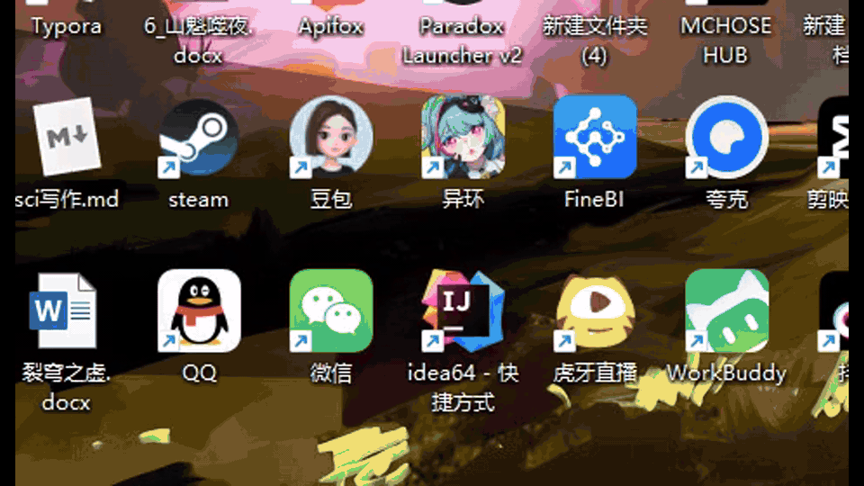
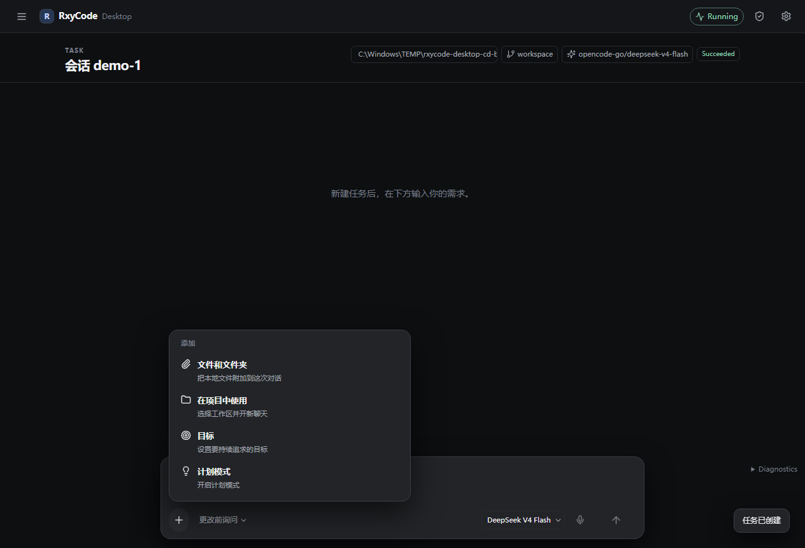
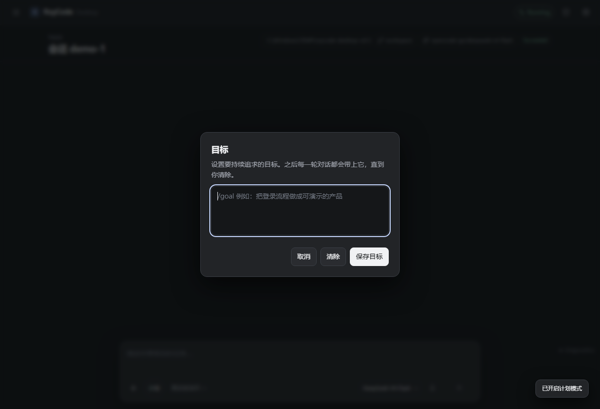
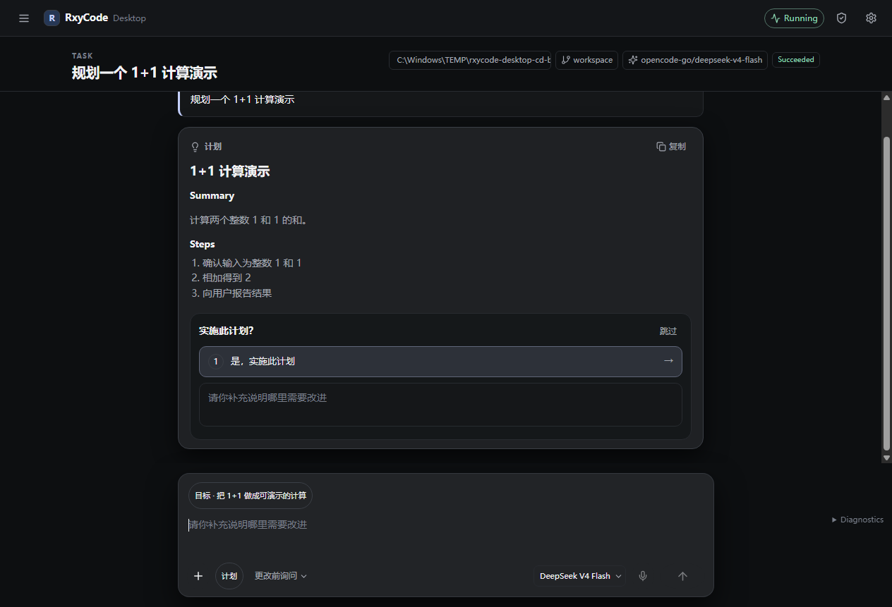

<!-- README_SYNC: source=working-tree; updated=2026-08-20 -->
<div align="center">

**English** · [简体中文](./README.zh-CN.md)

# RxyCode

**A local plan-and-execute coding agent for developers — type `rxycode` in cmd to open OpenTUI; Desktop GUI is optional. Every tool call goes through a safety gate.**

[⭐ Star this repo](https://github.com/xin-yi33/RxyCode) if you want a local agent that plans, runs tools, and asks before risky writes.

[](https://github.com/xin-yi33/RxyCode/releases/tag/v1.2.11)
[](https://www.python.org/)
[](LICENSE)
[](https://github.com/xin-yi33/RxyCode/actions/workflows/ci.yml)
[](https://github.com/xin-yi33/RxyCode/issues)
[](https://github.com/xin-yi33/RxyCode/discussions)
[](https://github.com/xin-yi33/RxyCode/stargazers)

<p>
  
</p>

</div>

Default CLI is **OpenTUI**. In `cmd` (or any terminal):

```bat
rxycode
```

The GIF above is that interface. GitHub plays it when you scroll to it. Desktop GUI screenshots are further down.

RxyCode is a Python coding agent. The core is headless: `Session` (`core/session.py`) wraps `AgentV2`. Frontends: **OpenTUI** (default), **Desktop** (`rxycode gui`), and **Ink** fallback. Complex work goes through LangGraph: plan → decompose → execute → validate → synthesize. Simple questions take a fast path. Isolated child agents, MCP, and 30+ tools sit behind a risk-classified safety gate.

## Features and advantages

| Feature | What you get | Where |
|---|---|---|
| Verify before “done” | A validator checks tool results against the original goal | `validation/` |
| Plan then execute | Hierarchical decomposition, dependency-aware parallel runs, then synthesis | `planning/`, `execution/`, `synthesis/`, `core/graph.py` |
| Safety gate on every tool | READ / WRITE / DANGER, write whitelist, approval dialogs, audit log | `core/safety/` |
| Two real surfaces | OpenTUI over stdio JSON-RPC; Desktop Plan / Goal / `+` menu | `frontend/opentui-app/`, `frontend/desktop-app/`, `appserver/` |
| Isolated child agents | Own session, tools, permissions, and budget | `core/subagents/` |
| Optional expert teams | Coordinator + SOP; **off** unless `settings.agents.enabled` | `core/agents/` |
| Headless core | `Session.prompt()` has no UI of its own; TUI and GUI only subscribe to protocol events | `core/session.py` |

## Quick start

### Requirements

| Requirement | Version | Notes |
|-------------|---------|-------|
| Python | 3.10+ | Backend runtime |
| Bun | latest | Auto-installed by the one-command installer when missing (OpenTUI) |
| Node.js | 20+ | Desktop GUI, Ink fallback (`RXYCODE_TUI=ink`) |
| OpenAI-compatible API key | — | Any provider you configure (OpenAI, DeepSeek, OpenCode Go, …) |

### Option 1: One-command install

**Windows PowerShell:**

```powershell
powershell -ExecutionPolicy Bypass -c "irm https://raw.githubusercontent.com/xin-yi33/RxyCode/v1.2.11/install.ps1 | iex"
rxycode
```

**macOS / Linux:**

```bash
curl -fsSL https://raw.githubusercontent.com/xin-yi33/RxyCode/v1.2.11/install.sh | sh
rxycode
```

The installer bootstraps `uv` if needed, creates an isolated tool environment, and installs the pinned **`v1.2.11`** release. That is the **CLI / OpenTUI** package. It does not include the Electron Desktop app.

Set `RXYCODE_NO_MODIFY_PATH=1` to skip PATH updates. A PATH-update failure is a warning; the install still succeeds.

**Downloads:** the latest release (**`v1.2.11`**) publishes **one** asset: `rxycode-1.2.11.tar.gz`. It does not ship a wheel or new Windows / macOS / Linux Desktop binaries. Desktop installers and portable zips stay on the still-open **[v1.2.10](https://github.com/xin-yi33/RxyCode/releases/tag/v1.2.10)** release (`RxyCode.Desktop-1.2.10-win.zip`, setup.exe, dmg, AppImage). GitHub “Source code” zip/tar.gz is the full backend+frontend tree for building from source — it is not a ready-to-run Desktop install. More detail: [docs/quickstart.md](docs/quickstart.md).

### Option 2: Run once with uv

```bash
uvx --from "git+https://github.com/xin-yi33/RxyCode.git@v1.2.11" rxycode
```

### Option 3: Permanent install

```bash
uv tool install --force "git+https://github.com/xin-yi33/RxyCode.git@v1.2.11"
rxycode
```

### Option 4: From source

```bash
git clone https://github.com/xin-yi33/RxyCode.git
cd RxyCode
python -m pip install -e .
rxycode
```

### Option 5: Docker

```bash
cp .env.example .env   # Set OPENAI_API_KEY and RXYCODE_API_TOKEN
docker compose up -d api       # API server (loopback only)
docker compose run --rm tui    # Interactive TUI (needs TTY)
```

### First launch

| Command | What opens |
|---------|------------|
| `rxycode` or `python -m RxyCode` | Default **OpenTUI** |
| `rxycode --version` | Package version, no runtime init |
| `rxycode gui` | Desktop **only after** you install a Desktop build (not part of the CLI/`uv` install) |
| `rxycode --api` | API server only (`api_server.py`) |
| `RXYCODE_TUI=ink rxycode` | Ink fallback TUI |

1. Run `rxycode`. The TUI opens even with no model configured.
2. If the model list is empty, OpenTUI shows a welcome hint and opens `/addmodel` (credentials are masked).
3. If at least one model is already in `~/.RxyCode/config.yaml`, there is no extra hint.
4. Type a natural-language task. Example: write a single-file `click-counter.html` in the current folder.
5. Headless (`rxycode --api`): set `RXYCODE_API_KEY` and run `rxycode config add-model <id> <provider-model-id> --base-url <url>`. The key is never accepted on the command line.

OpenTUI talks to the core over **stdio JSON-RPC**: the frontend spawns `python -m appserver`, which hosts `Session` → `AgentV2`. You see streaming tokens, tool calls, approval prompts when needed, and a final answer.

## Desktop GUI

v1.2.11 does **not** republish Desktop. Download the still-open [v1.2.10 GitHub Release](https://github.com/xin-yi33/RxyCode/releases/tag/v1.2.10):

| OS | Asset |
|----|--------|
| Windows | `rxycode-desktop-1.2.10-setup.exe` (installer) or `RxyCode.Desktop-1.2.10-win.zip` (portable) |
| macOS | `.dmg` (unsigned) |
| Linux | `.AppImage` (`chmod +x`; if it exits immediately, `APPIMAGE_EXTRACT_AND_RUN=1 ./rxycode-desktop-1.2.10.AppImage`) |

`rxycode gui` only launches that installed app (`~/.rxycode/desktop`, `RXYCODE_DESKTOP_DIR`, or `--desktop-dir`). A CLI-only install cannot start Desktop. Composer sits at the bottom of the task pane. The `+` button opens:

| Menu item | What it does |
|-----------|----------------|
| 文件和文件夹 | Attach a local file; the path is written into the prompt |
| 在项目中使用 | Pick a workspace and start a new chat |
| 目标 | Open the Goal dialog (Escape or overlay click closes it) |
| 计划模式 | Toggle Plan mode (agent stays on the plan document) |

Plan cards offer **是，实施此计划**, a **补充说明** field, and **跳过**. Permission labels in the UI are 更改前询问 / 自动编辑 / 完全访问. Switching to 完全访问 asks for confirmation (Escape cancels). Packaged v1.2.10 Desktop shows **1.2.10** in Settings. Full GUI notes: [docs/GUI.md](docs/GUI.md).

<p align="center">
  
</p>
<p align="center">
  
</p>
<p align="center">
  
</p>
<p align="center">
  
</p>

## Architecture

```
OpenTUI (frontend/opentui-app)     Desktop (frontend/desktop-app)
        │ stdio JSON-RPC                    │ stdio JSON-RPC
        └──────────────┬────────────────────┘
                       ▼
              python -m appserver
                       │
                       ▼
              Session (core/session.py)
                       │
                       ▼
              AgentV2 (core/agent_v2.py)
                 ├── simple query  →  fast path + cache
                 ├── multi-task    →  isolated child agents
                 ├── compose       →  Plan + Build
                 └── complex       →  LangGraph:
                       goal_planner → decomposer → executor
                            → ToolOrchestrator + core/safety
                            → validator → synthesizer

Ink fallback: RXYCODE_TUI=ink → api_server.py (HTTP + SSE) → same Session
```

`Session` is transport-agnostic: it emits protocol events; it does not draw UI. `appserver` maps those events to stdout JSON-RPC. `api_server.py` maps the same events to SSE for Ink.

## Modes

| Surface | How | Behavior |
|---------|-----|----------|
| Build | `/build` (TUI) or Desktop default | Plan → decompose → execute → validate → synthesize |
| Plan | `/plan` or Desktop 计划模式 | Read-only analysis and a plan document; no file edits until you Build |
| Compose | `/compose` | Plan + build with a shorter pipeline |

## Configuration

Stored at `~/.RxyCode/config.yaml`. The active model's `base_url` is the one you selected — RxyCode does not silently rewrite it to another provider.

```yaml
cache:
  enabled: true
  prompt_prefix_cache: true   # Provider-side KV cache
  ttl: 3600

# Example: OpenCode Go
models:
  opencode-go/deepseek-v4-flash:
    model_name: deepseek-v4-flash
    provider_id: opencode-go
    provider_name: OpenCode Go
    api_key_env: OPENCODE_GO_API_KEY   # or api_key_secret, stored outside the repo
    base_url: https://opencode.ai/zen/go/v1
    max_tokens: 8192
    temperature: 0.7
```

Use `/addmodel` in OpenTUI for a guided wizard. Do not put API keys in the repo, README, or screenshots.

## Safety boundary

Before a tool runs, `core/safety/` classifies it:

- **READ** — inspect only (`read`, `grep`, `glob`, `webfetch`, …)
- **WRITE** — reversible side effects (`write`, `edit`, most `bash`)
- **DANGER** — destructive or installer-like commands; bash can escalate by pattern (`rm -rf /`, `git push --force`, …)

Writes outside the whitelist are blocked. The TUI and Desktop raise an approval dialog; the audit log is `~/.RxyCode/logs/audit.jsonl` with sensitive keys redacted. Default Desktop permission is 更改前询问.

## Commands and shortcuts (OpenTUI)

| Command | Description |
|---------|-------------|
| `/help` | All commands |
| `/addmodel` | Add a model (masked credentials) |
| `/models` / `/model <name>` | List / switch models |
| `/build` `/plan` `/compose` | Work mode |
| `/clear` | Clear conversation context |
| `/memory add/list/search` | Memory |
| `/queue add/run` | Task queue |
| `/cache` | Cache stats |
| `/language` | UI language |
| `/thinking` | Thinking panel |
| `/children` `/child` `/parent` | Isolated child-agent tree (when subagents are on) |

| Shortcut | Action |
|----------|--------|
| `Tab` | Switch work mode |
| `Ctrl+P` | Command palette |
| `Ctrl+T` | Toggle thinking |
| `Esc` | Cancel |
| `Ctrl+C` | Copy / cancel stream / clear input; twice within 2s to quit |

## Version history

| Version | Date | Highlights |
|---------|------|------------|
| [v1.2.11](https://github.com/xin-yi33/RxyCode/releases/tag/v1.2.11) | 2026-08 | Expert teams (off by default); CLI reliability; GitHub Release is `rxycode-1.2.11.tar.gz` only — Desktop stays on v1.2.10 |
| [v1.2.10](https://github.com/xin-yi33/RxyCode/releases/tag/v1.2.10) | 2026-08 | Desktop Plan / Goal / `+` menu; plan card Build/Revise/Skip; default CLI remains OpenTUI (`rxycode`) |
| [v1.2.9](https://github.com/xin-yi33/RxyCode/releases/tag/v1.2.9) | 2026-08 | Isolated subagents (Phase C): independent child sessions; `@agent` mention, Task tool, `subtask=true`; OpenTUI child tree |
| [v1.2.8](https://github.com/xin-yi33/RxyCode/releases/tag/v1.2.8) | 2026-08 | Model adaptation: DeepSeek v4, Doubao (ark), Anthropic Claude 5 family; exact capability isolation |
| [v1.2.7](https://github.com/xin-yi33/RxyCode/releases/tag/v1.2.7) | 2026-08 | Completed answers no longer discarded by failed read-only probes; smarter web-research queries; Doubao provider |
| [v1.2.6](https://github.com/xin-yi33/RxyCode/releases/tag/v1.2.6) | 2026-08 | webfetch decoding, MCP mis-routing, Windows shell/encoding, web search hardening |
| [v1.2.5](https://github.com/xin-yi33/RxyCode/releases/tag/v1.2.5) | 2026-08 | DeepSeek / Qwen / Claude adaptation; lazy imports; explicit request routing; stdio transport |
| [v1.2.4](https://github.com/xin-yi33/RxyCode/releases/tag/v1.2.4) | 2026-08 | Add-model polish; eval harness; typed protocol + TypeScript client |
| [v1.2.3](https://github.com/xin-yi33/RxyCode/releases/tag/v1.2.3) | 2026-07 | 10 provider presets, auto discovery, batch add |
| [v1.2.2](https://github.com/xin-yi33/RxyCode/releases/tag/v1.2.2) | 2026-07 | Auto-install Bun + OpenTUI deps; empty-model `/addmodel` |
| [v1.2.1](https://github.com/xin-yi33/RxyCode/releases/tag/v1.2.1) | 2026-07 | Ship OpenTUI sources in the wheel |
| [v1.2.0](https://github.com/xin-yi33/RxyCode/releases/tag/v1.2.0) | 2026-07 | OpenTUI default TUI (Ink fallback) |
| [v1.1.0](https://github.com/xin-yi33/RxyCode/releases/tag/v1.1.0) | 2026-07 | Ink TUI, SSE, Docker, CI, one-command installers |
| [v1.0.0](https://github.com/xin-yi33/RxyCode/releases/tag/v1.0.0) | 2026-06 | LangGraph rewrite: plan-and-execute, tools, tiered memory |
| [v0.3.3](https://github.com/xin-yi33/RxyCode/releases/tag/v0.3.3) | 2025-12 | Initial release: verification + MCP |

Full notes: [CHANGELOG.md](CHANGELOG.md). Per-version copy: [docs/release-notes/](docs/release-notes/). Expert teams: [docs/agent/README.md](docs/agent/README.md).

## License

[MIT](LICENSE) © RxyCode contributors

If RxyCode is useful, [star the repo](https://github.com/xin-yi33/RxyCode) so you can find it again.

## Community

The project forum is [GitHub Discussions](https://github.com/xin-yi33/RxyCode/discussions) — no extra account beyond GitHub.

| Need | Where |
|------|--------|
| How-to / install / config | [Q&A](https://github.com/xin-yi33/RxyCode/discussions/new?category=q-a) |
| Feature idea | [Ideas](https://github.com/xin-yi33/RxyCode/discussions/new?category=ideas) |
| Reproducible bug | [Issues](https://github.com/xin-yi33/RxyCode/issues/new?template=bug.yml) |
| Enable the same forum on your own repo | [docs/community.md](docs/community.md) · [中文](docs/community.zh-CN.md) |
