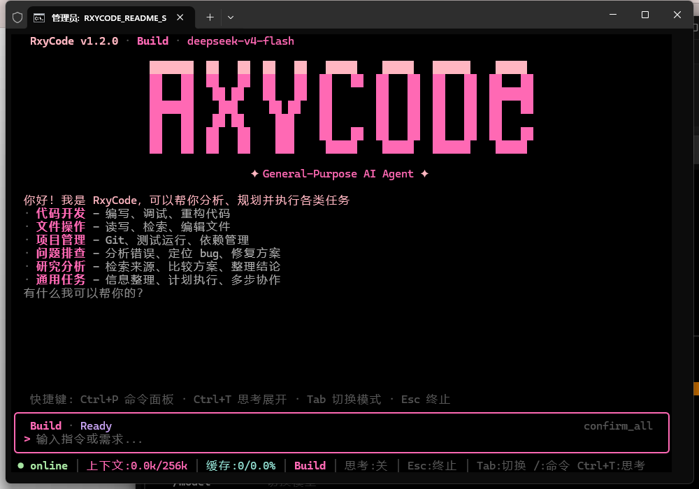
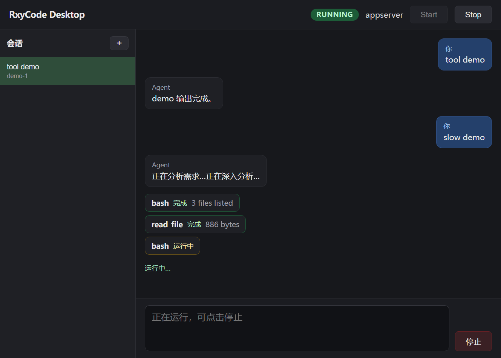
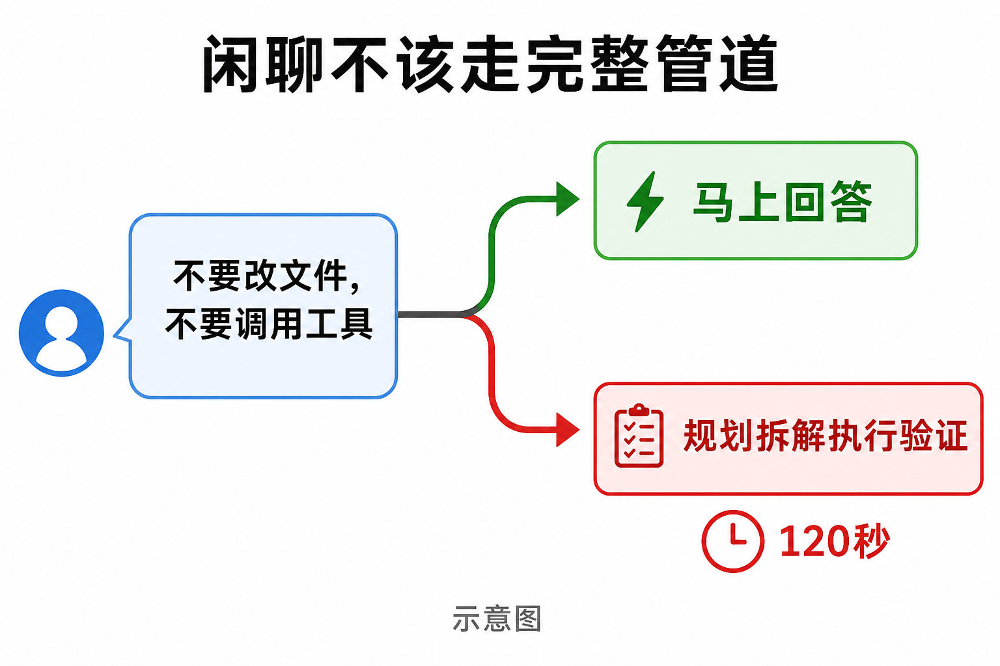
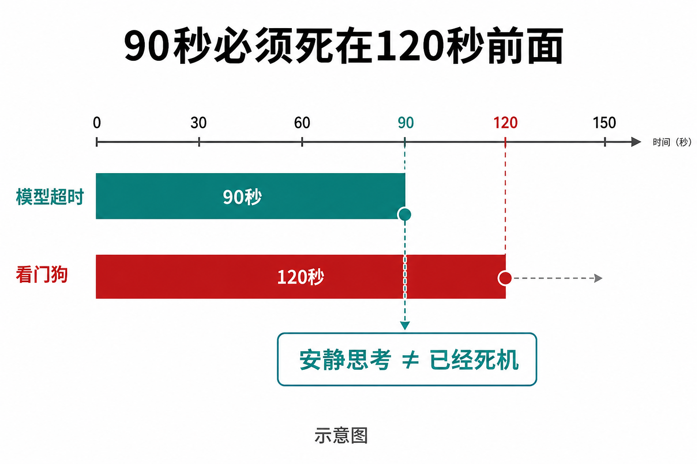
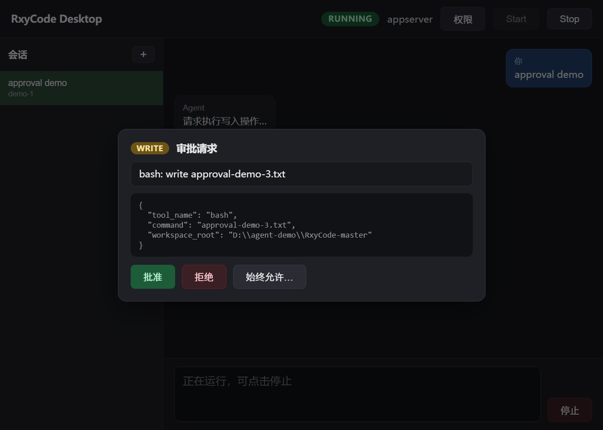

# 一句闲聊，把编程助手卡死了 120 秒

有人打了一句：

用三句话规划成都两日美食游。不要改文件，不要调用工具。

屏幕卡住了。超过 120 秒。

不是网卡。仓库测试把这次现场记下了，来源是真实界面。

助手名叫 RxyCode。它本职是改代码、跑命令、拆任务。这句话写明了：别动手。

它还是把这句话，当成一项工程做了。

你会用 AI 写代码，多半见过这种节奏：想一步，调一次工具，再想。改一行，够用。

RxyCode 偏要更狠。先规划，再拆开，再执行。做完还核对：你说成功了，结果真对上目标了吗？

2026 年 8 月的版本，连子任务都能单独开一间屋。自己的上下文，自己的权限。

认真干活，没问题。

认真过头，问题来了。

「规划成都怎么吃」，在它眼里也可能像「做一个东西」。做东西，就要规划、拆解、执行、验证。

你只是想听三句哪里好吃。

复杂任务确实该这么跑。一条命令完了，下一条还在转。

禁止动手的闲聊，不该进来。

难处就这一句：同一个输入框，两种活。

工程要工具、要你点头、要验证。

闲聊要马上回，而且不许动手。

「不要调用工具」六个字，按设计应当走快的那条路。成都那句里就有。

现场却叠了四层。

缓存没帮上忙。旅行规划被看成「做个东西」。旁边还在预热，最长大约 90 秒。外部工具还在刷新，这句闲聊跟着干等。

用户只看见：卡住。然后被看门狗杀掉。

看门狗默认 120 秒没进度，就杀后台。本意防死机。这回杀的是还没开口的一句闲聊。

后来改超时层级。模型自己先在 90 秒报错，别让 120 秒的看门狗来冒充「系统死了」。

问候、明确不让用工具，可以跳过那些启动税。

判断很土：你的失败，要失败成这句话没答好。不要失败成整台助手死机。

没在每台电脑上重放。不能吹「现在所有人都秒回」。能确定的是：120 秒这件事发生过，并且被写成了测试。

修完首轮，看门狗又杀错过一种活人。

第二轮，模型没停。是心跳停了。子会话查询把汇报通道换掉。思考折叠了，不发进度。看门狗看见 120 秒静音，按设计杀人。

三个目标分开都对。叠在一起，「还在想」变成「已经死」。

后来没改 120 这个数。改的是：什么算还活着。

那能不能为了快，把安全门拆了？

仓库没拆。

写文件会停下来问你。删盘、乱执行下载脚本，会抬到危险。还可以演习，只说「没真执行」。做完要核对，不是模型说成功就算。

2026 年 8 月 11 日一次门禁：18 项过 17 项。剩下那项，基线里本来就失败。这不是「你用也 94.7%」。这是一张切片。

许可证是 MIT。源码能用、能改、能再分发。不是有人免费帮你托管。

适合谁？你有真实项目，要助手规划、动手、再核对，改文件前先问你。

不适合谁？你要它不问就改生产。你拿一句闲聊的快慢，当全部能力。

现在可安装版本写在文档里：v1.2.9。仓库：github.com/xin-yi33/RxyCode

成都那句还在测试里。不是攻略。是挡板。

下一句「不要调用工具」，别再被拖去受刑。
