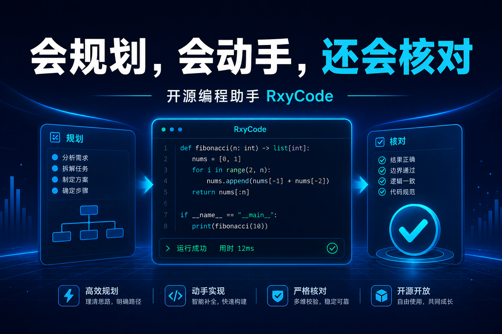
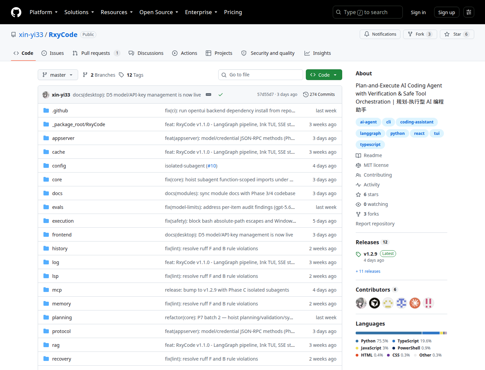
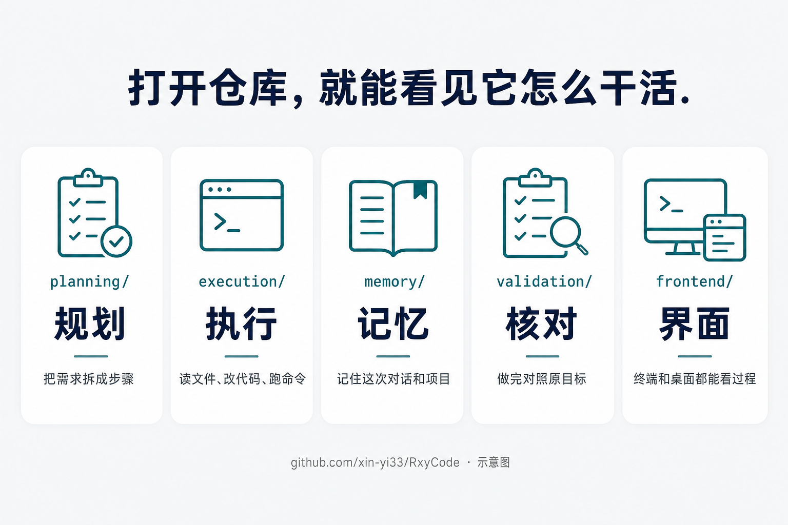
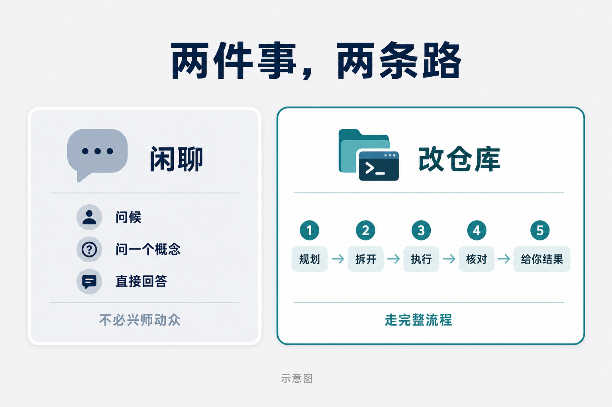
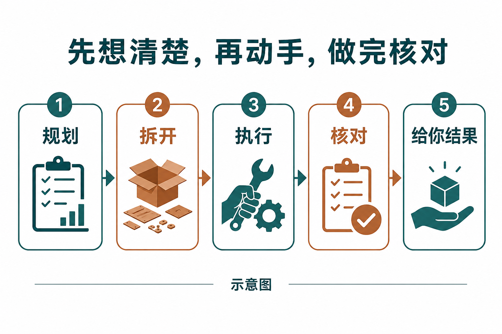
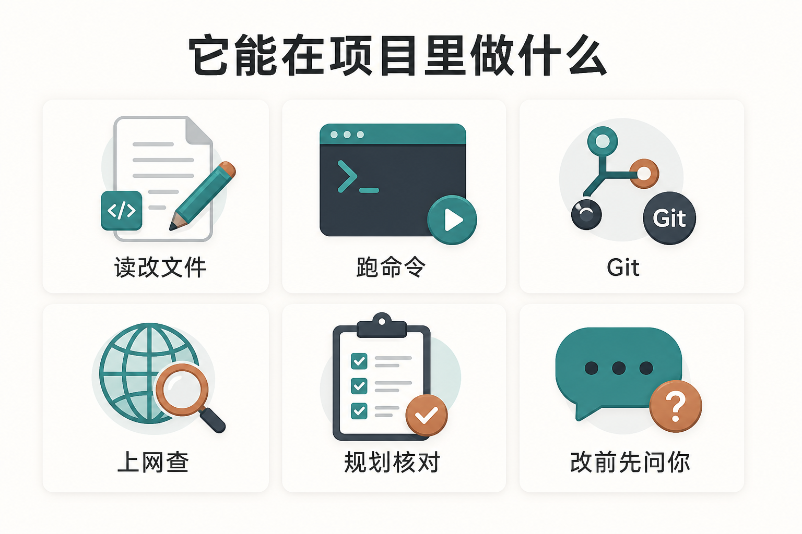
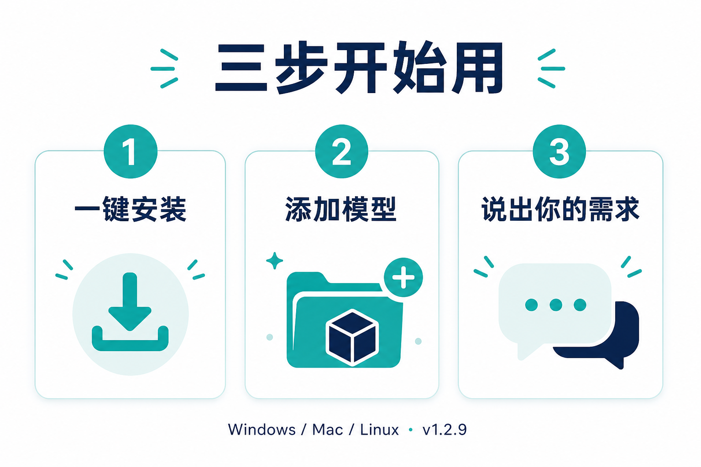

# 打开以后，它开始读你的项目、改文件、跑命令

界面上出现一行：bash，旁边写着「运行中」。

上面已经跑完两条：列出文件，读过一个文件。下面还有输入框，写着可以停止。

这不是聊天记录。这是 RxyCode 在你的项目里动手。

它是开源编程助手。当前文档版本 v1.2.9。许可证 MIT。装在自己电脑上，用你自己的模型密钥。

仓库就在 github.com/xin-yi33/RxyCode。下面这张是仓库首页，不是示意图。

截至 2026 年 8 月 13 日这张页面：公开仓库，MIT，最新发布 v1.2.9，274 次提交，6 个 Star，3 个 Fork。规划、执行、记忆、核对、前端，都摊在目录里。

示意图。目录名能对上它实际在干的事。

终端打开就是一个工作台。用大白话说需求。没有模型也会先出来，再带你添加。🔒 密钥输入有掩码。

## 💬 你会聊天的 AI，和会改仓库的助手，不是一回事

你一定用过会写代码的 AI。方案可以写得很完整。打开文件夹，可能一行都没动。

反过来也常见：它改了，你还没同意。

RxyCode 认的是后一种工作。复杂事先规划，再拆开做。做完有核对：工具结果是不是真的对上你一开始说的目标。改文件、跑有风险的命令，会先问你。也可以只看它准备做什么，先不真执行。

规划模式可以只分析、不动文件。觉得步骤对了，再走构建。

这是桌面端截图。过程看得见。不是聊完丢你一段「已经完成」。

示意图。一边是只会给方案。一边是能读项目、改文件、跑命令；改前问你；做完核对。

## 🧩 大事走完整流程，闲聊不必兴师动众

不是每句话都要拆任务。

问候、只问一个概念，有更快的回答路径。你也可以写明：这次不要动文件、不要调用工具。

要改仓库，才走规划、拆解、执行、核对。

示意图。闲聊直接回。改仓库才走完整流程。

v1.2.9 起，大任务还能拆给独立的子助手。各自有上下文、工具、权限和预算。主对话不用把所有细节揉成一句。

仓库文档里的顺序就是这样：规划，拆开，执行，核对，把结果给你。

干活时它会用到内置工具：读、改、搜代码、跑命令、处理 Git、上网查、抓网页。项目大了能检索代码库。需要接外部工具时支持 MCP。语言服务相关能力还在实验。宣传页写着三十多种，不是装饰。

常用的还有分层记忆和三层缓存。重复的小问题不必每次从零开始。这是设计，不是「一定更快」的承诺。

## 🔐 改你的文件之前，屏幕会停一下

助手要写入时，会弹出审批。同意、拒绝，或以后都允许。

产品截图。电脑还是你的。

核对也不是口号。报告成功前，有专门步骤看结果对不对得上原目标。评测跑的是完整流程，去对保存的基线。仓库里有一次门禁记录是 18 项里过 17 项。那是一张切片，不是你用起来的成绩单。

中文说明和发布说明里写过两组测试全绿数字，时点不同。自己跑一遍更准。

## 🚀 装上，对着你自己的仓库说一句

Windows、Mac、Linux 都有一键安装。装完输入 rxycode。需要 Python 3.10 及以上，以及一份兼容 OpenAI 接口的密钥。国内常用模型也可以。

第一次不必上强度。用规划模式看它怎么拆你的需求。步骤对了，再让它动手。

它解决的是「真的改项目」。它不替代你判断要不要改生产环境。MIT 的意思是源码可以用、可以改、可以再分发，不是有人免费替你托管一台。

回到开头那张图。命令在跑，文件在读。那就是它和聊天框的差别。👉 想试，去搜 RxyCode。
