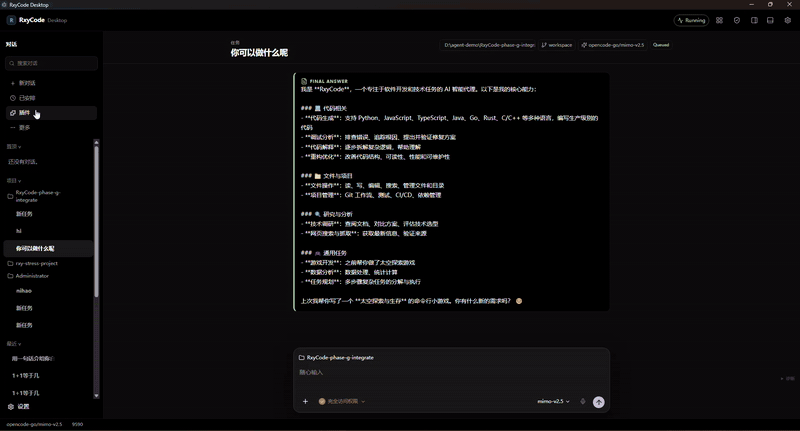

# RxyCode Desktop GUI

RxyCode ships a desktop application (Electron + React) next to the OpenTUI
terminal interface. **v1.3.0 is the workbench release:** the same headless
`Session` drives a three-column shell (sessions, composer, optional Files /
Browser), not the leftover 1.2.10 chat window. Launch it with `rxycode gui`,
or install the packaged Windows / Linux builds from the
[GitHub Release](https://github.com/xin-yi33/RxyCode/releases/tag/v1.3.0).
This tag does **not** ship macOS.

<p align="center">
  
</p>

## How it launches

`rxycode gui` resolves the packaged desktop executable in this order
(CLI/`uv`/`install.sh` alone is not enough — download a Desktop asset first):

1. `--desktop-dir <path>` if given,
2. `~/.rxycode/desktop` (the installer's default install directory),
3. `RXYCODE_DESKTOP_DIR` if set,
4. any `rxycode-desktop` / `rxycode-desktop.exe` on `PATH`,
5. otherwise it falls back to `npm run dev` from a source checkout.

The backend (`python -m appserver`) is started automatically by the desktop
app as a child process, so double-clicking the shortcut or running
`rxycode gui` is all you need.

## Install options

### Option A — installer (Windows)

Run `rxycode-desktop-<version>-setup.exe`. The assisted wizard:

- defaults the install directory to `%USERPROFILE%\.rxycode\desktop`
  (the same folder `rxycode gui` searches), and
- lets you **browse** to a custom directory before installing,
- offers a **"Create a desktop shortcut"** checkbox — checked by default,
  uncheck it to skip the shortcut.

The installer UI language follows your system: Chinese on Chinese systems,
English everywhere else.

### Option B — portable zip (Windows)

Download `RxyCode.Desktop-<version>-win.zip` (that is the published
portable archive name). Extracting creates a wrapper folder
`RxyCode.Desktop-<version>-win/rxycode-desktop.exe` plus `resources/`.
Run that exe — no installer and no shortcut are created. Move the wrapper
folder or its contents into `~/.rxycode/desktop`; `rxycode gui` finds either
layout. `--desktop-dir` may point at the wrapper folder, the exe, or the
parent directory.

### Option C — Linux

- Linux: `chmod +x rxycode-desktop-<version>.AppImage` then run it.
  Modern distros often lack FUSE (`libfuse.so.2`); if the AppImage exits
  immediately, use `APPIMAGE_EXTRACT_AND_RUN=1 ./rxycode-desktop-<version>.AppImage`.
  Putting the file in `~/.rxycode/desktop` and running `rxycode gui` does
  the executable bit and extract-and-run for you. The packaged app also
  passes `--no-sandbox` on Linux so the AppImage is not blocked by the
  unsigned chrome-sandbox helper.
- macOS is **not** in the v1.3.0 GitHub Release. Use OpenTUI, or
  `npm run dev` from a source checkout.

## Main window

| Area | What it shows |
|------|---------------|
| Session list | Pinned / project / recent; `+` new task; running spinner before the title |
| Chat area | Streaming messages, tool cards, final answer |
| Composer | Natural-language task; `+` opens the action menu; permission preset |
| Top bar | Brand, connection state, Files / Browser / plugin toggles |

## Composer `+` menu

| Menu item | What it does |
|-----------|--------------|
| Attach file | Attach a local file; the path is written into the prompt |
| Workspace | Pick a workspace and start a new chat |
| Goal | Open the Goal dialog (Escape or overlay click closes it) |
| Plan mode | Toggle Plan mode (agent stays on the plan document) |

## Plan, goal and approval

- **Plan mode** keeps the agent on a plan document instead of editing files
  immediately. The plan card offers **Build**, a **Revise** field, and
  **Skip**.
- **Goal dialog** stores a standing goal for the session.
- Permission labels are 更改前询问 / 自动编辑 / 完全访问; switching to
  完全访问 asks for confirmation (Escape cancels).

## Settings

- **更新与诊断**: manual check/download/install of updates; crash-report
  consent defaults to off and diagnostic bundles are sanitized.
- **关于**: shows the product version of that Desktop build
  (v1.3.0 packaged assets display **1.3.0**).

## Development

```powershell
cd frontend/desktop-app
npm install
npm run dev        # HMR development
npm run typecheck  # tsc for main/preload/renderer
npm run build:win  # Windows package (nsis installer + zip) with embedded runtime
npm run build:linux # Linux AppImage
```
